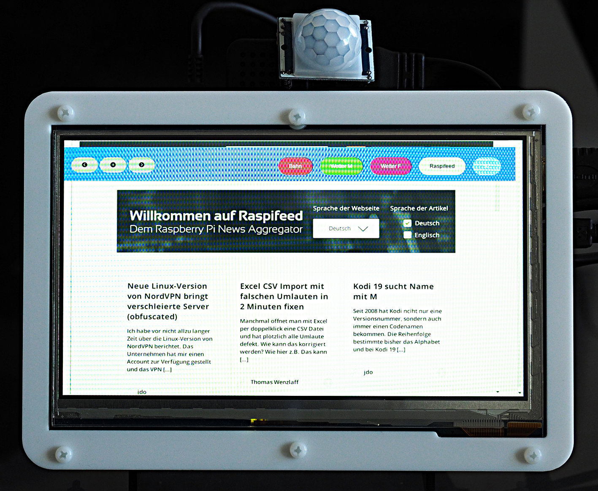
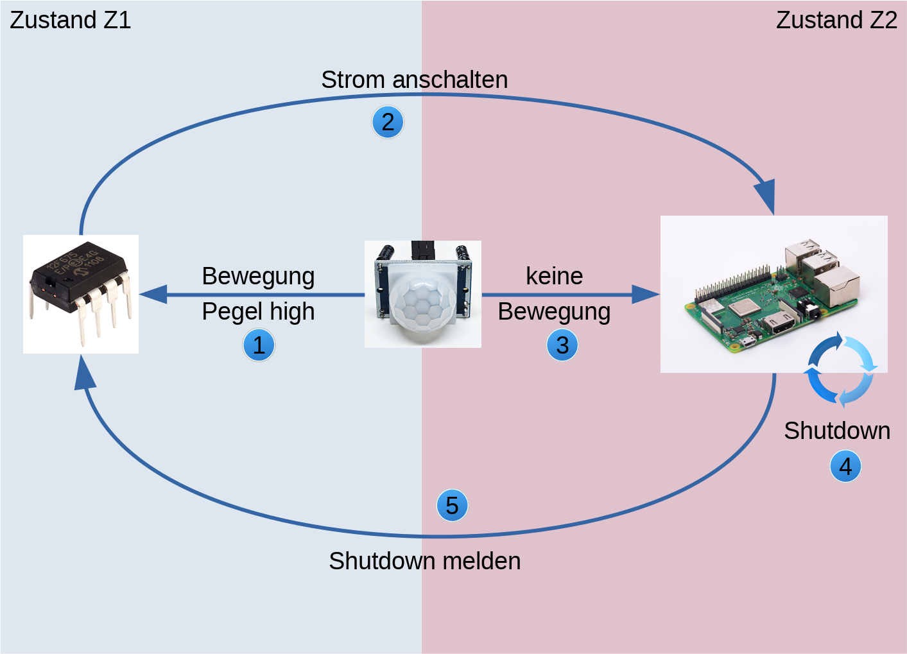
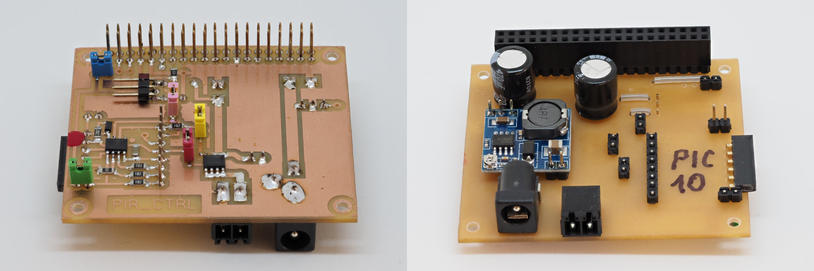

Pi-Infoscreen
=============

Overview
--------

This project implements a small infoscreen using a Pi and a 7"-touchscreen.
For efficiency reasons, the screen should only run while somebody is at
home, so the system automatically boots when it detects motion and automatically
shutsdown when nothing moves anymore.

Once booted, the system cycles through a list of predefined webpages.

Hardware
--------

The hardware consists of

  - a microcontroller (PIC12F675, but almost any microcontroller will do)
  - an IR motion sensor (HC-SR501, cheap and widely available)
  - a Pi3
  - a Waveshare 7"-touchscreen
  - a circuit with a P-channel mosfet

For details about the PIC and the circuit, browse the
[hardware-directory](hardware/ "hardware-directory").

Note that it is possible to run the infoscreen without the added luxury
of a PIC and/or an IR motion sensor. In case you don't have a PIC you
have to manually start the system (or let it run all the time). Since
using the sensor does not require soldering, you could use the sensor
together with the Pi to at least automatically shutdown your system.

States and Events
-----------------

The system starts in state "Z1": the Pi is shutdown and the PIC controls
the motion sensor (PIR). Motion will trigger a high-level on the out-pin
of the PIR, which is attached to the PIC. Now the PIC will set the gate of
the mosfet to low, thus turning on current for the Pi.

Now we are in state "Z2": the Pi is up and running and in charge of any
interrupts from the PIR. In this state the PIC is sleeping. Everytime the
Pi detects motion he will postpone his shutdown for a given time (e.g.
15 minutes). If there is no motion for 15 minutes, the Pi will shutdown
and pull Pin4 high. This is the signal for the PIC that we are back to
state "Z1" and to take over again.

Hardware Setup
--------------

The [circuit](hardware/pir_ctrl-circuit.gif "circuit") shows the wiring of
the project. The PIR-out is connected to the GP2 of the PIC as well as
GPIO17 of the Pi. In addition, GPIO4 of the Pi is connected to GP4 of the
PIC - the Pi uses this connection to signal shutdown to the PIC.

Note that this version

also uses a step-down converter from 12V to 5V to supply a stable voltage
to the system.

Installation and Configuration
------------------------------

You should start out with a fresh install of Raspbian-Pixel desktop (tested
with Stretch, other versions might or might not work). Then run

    git clone https://github.com/bablokb/pi-infoscreen.git
    cd pi-infoscreen
    sudo tools/install
    cd ..
    git clone https://github.com/bablokb/gpio-poll-service.git
    cd gpio-poll-service
    sudo tools/install

The second install command will ask you to edit `/etc/gpio-poll.conf`, but
this is not necessary since the first install provides a suitable configuration.

*Note that the installation of the pi-infoscren project will alter your
`/boot/config.txt`. It configures HDMI for the 7"-touchscreen from Waveshare.
If you don't us this display then you must edit the file before rebooting
your system!*

The installation also modifies the autostart-behavior of the system. During
boot, it will automatically load chromium in kiosk-mode and show a local
web-page in app-mode which in turns cycles through a list of configured web-pages.

You can modify the autostart-behavior in
`/home/pi/.config/lxsession/LXDE-pi/autostart` and the list of web-pages in
`/usr/local/lib/iscreen/web/js/config.js`.

To make better use of the screen-space it is advisable to install a
so called "user-agent-switcher" within chromium from the chrome-webstore. Using
the switcher chromium can prentend to be running on a small device
(e.g. an iPhone6) and some (but not all) webpages will deliver pages
more suitable for small screens.
